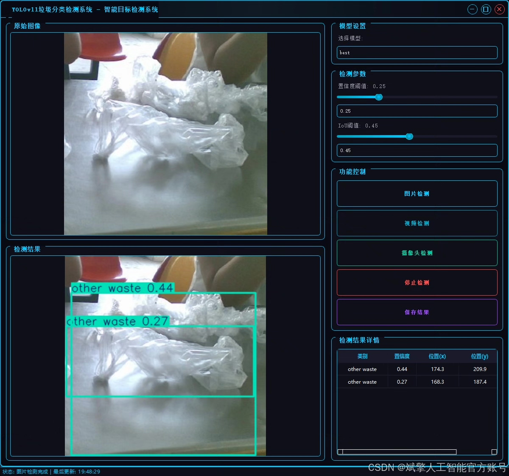
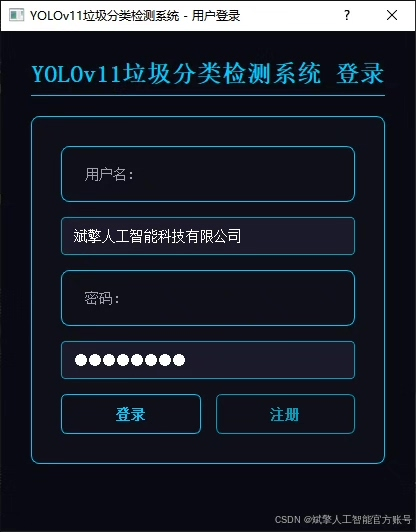
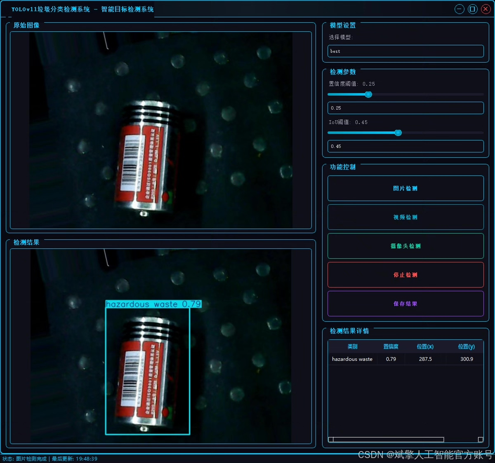
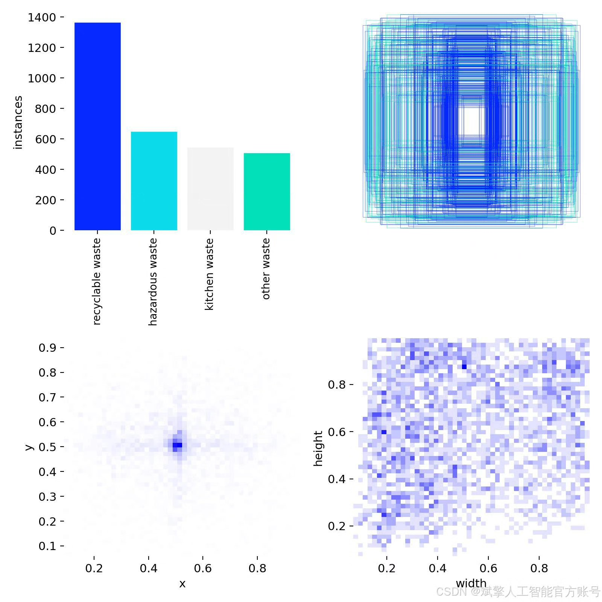
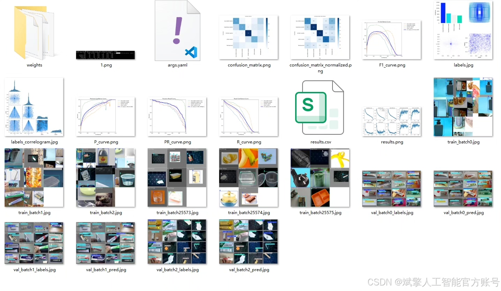
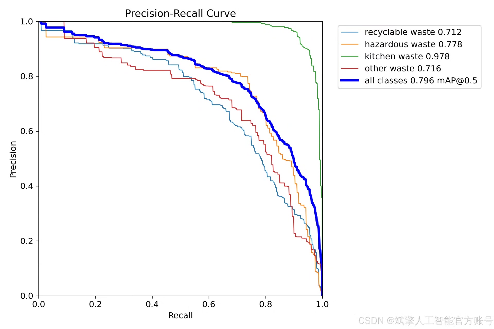
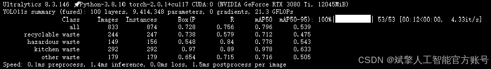
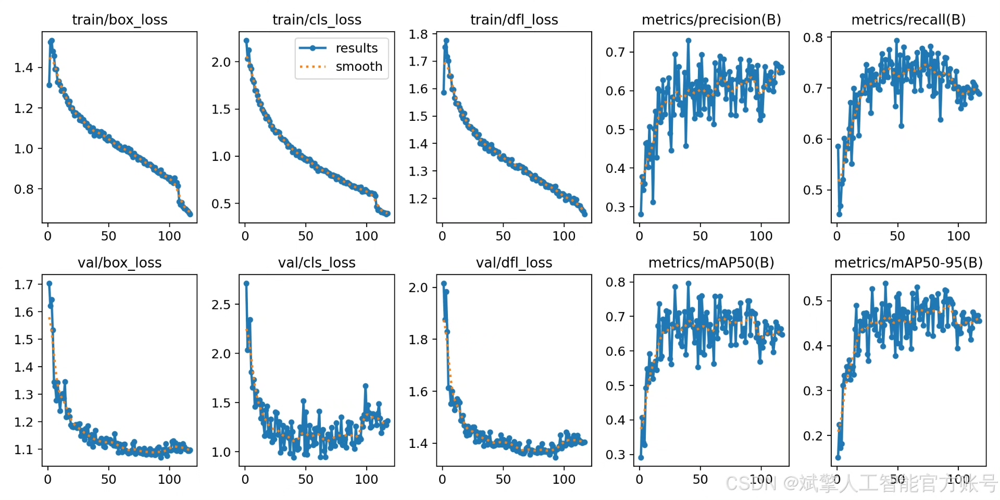
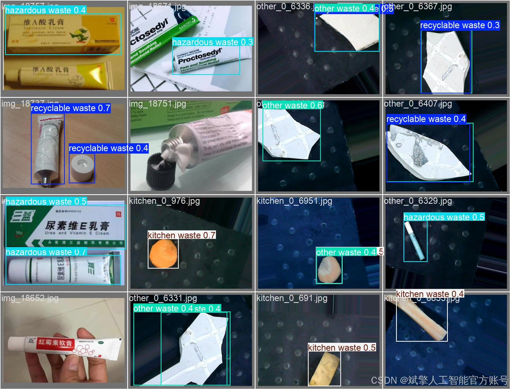

# YOLOv11 Classification System for Waste Sorting

## Body

YOLOv11 is a deep learning model developed by the University of Oxford's YOLO (You Only Look Once) team. It is a real-time object detection system that can detect and classify objects in images. The YOLOv11 model has been trained on a large dataset of images, including those from different categories such as animals, plants, fruits, vegetables, etc.

The YOLOv11 model uses a convolutional neural network architecture with a single-stage detection approach. It consists of three main components: the backbone network, the region proposal network (RPN), and the classification network. The backbone network is a pre-trained convolutional neural network that extracts features from the input image. The RPN generates bounding box coordinates for the detected objects. The classification network classifies the objects based on their category labels.

The YOLOv11 model has achieved state-of-the-art performance in object detection tasks, especially in real-time scenarios. It has been widely used in various applications such as autonomous vehicles, drones, and smart homes.

(Full product description was not available from the source page.)

## Images

## Payment

Here is a pay link on Stripe ( https://buy.stripe.com/3cs8yP7sY87d0vu9AB ). Please contact me lonlonago@foxmail.com after funding $89, and I will send you a complete data files , thank you!

